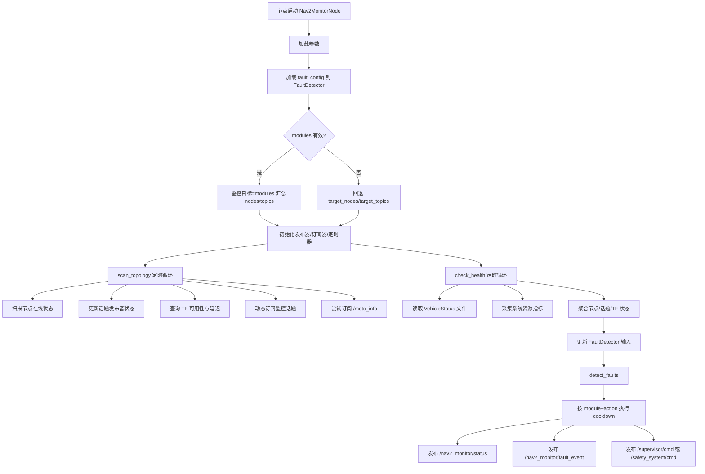
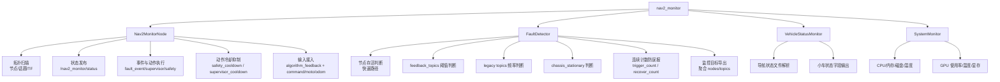

# nav2_monitor 架构图（流程图 / 数据流图 / 功能图）

## 1) 流程图（运行流程）



## 2) 数据流图（Data Flow）

```mermaid
flowchart LR
    subgraph Inputs[外部输入]
      FC[fault_detector_config.yaml]
      AF[/nav2_monitor/algorithm_feedback]
      CMD[/command]
      MOTO[/moto_info]
      ODOM[/odom]
      VS[vehicle_status_file]
      SYS[/proc + /sys + NVML]
      ROSG[ROS Graph + TF]
    end

    subgraph Core[nav2_monitor 核心]
      N[Nav2MonitorNode]
      FD[FaultDetector]
      VM[VehicleStatusMonitor]
      SM[SystemMonitor]
      MV[MultiValueJudge<br/>trigger/recover]
      CD[Action Cooldown<br/>module+action]
    end

    subgraph Outputs[输出]
      ST[/nav2_monitor/status]
      FE[/nav2_monitor/fault_event]
      SP[/supervisor/cmd]
      SA[/safety_system/cmd]
    end

    FC --> FD
    ROSG --> N
    AF --> N
    CMD --> N
    MOTO --> N
    ODOM --> N
    VS --> VM --> N
    SYS --> SM --> N

    N -->|node_status/topic_freq + feedback + chassis state| FD
    FD --> MV --> N
    N --> CD --> SP
    N --> CD --> SA
    N --> FE
    N --> ST
```

## 3) 功能图（模块功能分解）



