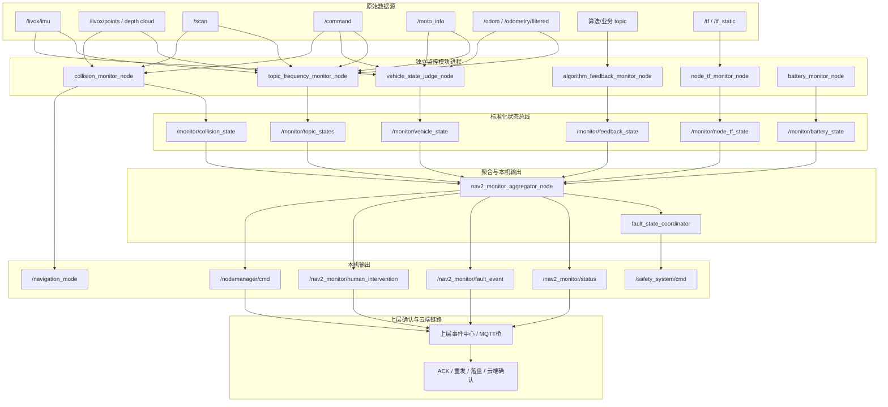
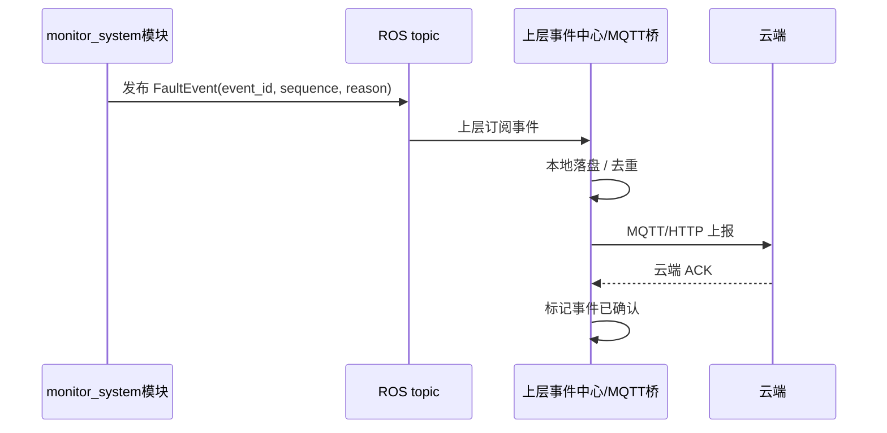
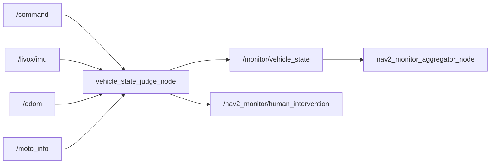
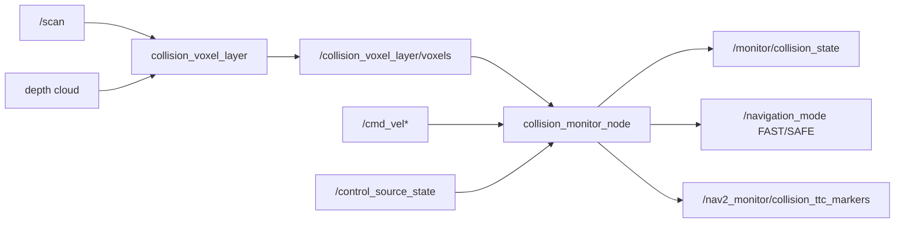

# 监控系统模块独立化与可靠数据联通设计方案

本文档描述 `monitor_system` 后续从“单节点多职责”演进为“多进程独立监控模块 + 标准化 topic 数据联通 + 上层确认闭环”的设计方案。

设计重点不是简单拆 topic，而是在 CPU 满载、部分模块异常、DDS 队列拥塞、节点重启等真实运行条件下，尽量做到：

- 一个模块异常不拖垮其他模块。
- 高频数据处理不阻塞低频状态、故障事件和人工介入提醒。
- 模块之间通过清晰的数据契约互通。
- 本系统只负责标准化发布事件与状态，ACK、重发、落盘、云端确认由上层模块负责。

## 0. 文档范围与设计结论

### 0.1 适用范围

本文档面向 `monitor_system` 的后续架构升级，覆盖：

- `nav2_monitor` 内部监控职责拆分。
- 频率检测、小车状态判断、碰撞/TTC 判断、算法反馈判断、节点/TF 判断、电池判断的模块边界。
- 模块之间的数据链路、topic 契约、QoS 策略。
- CPU 满载、数据源丢失、模块崩溃、DDS 队列拥塞下的降级行为。
- 与 `nodemanager` 节点管理器、外部 MQTT/云端上报模块的职责边界。

本文档不覆盖：

- MQTT 协议字段设计。
- 云端 ACK 协议。
- 上层事件中心落盘格式。
- 具体底盘私有协议改造。
- Nav2 控制器内部算法实现。

### 0.2 核心结论

如果目标是“精确、稳定、响应快，并且所有模块尽量互不影响”，单纯增加线程不足以解决根因。推荐架构是：

```text
关键判断器多进程隔离
+ 低频标准状态总线
+ 高频原始数据小队列保最新
+ 状态与事件分离
+ 上层负责 ACK/重发/落盘/云端确认
+ nodemanager 节点管理器按模块重启
+ 关键安全进程调度优先级保障
```

### 0.3 关键设计约束

- 实机运行配置统一以 `/opt/ry/config/Monitor/` 为准，仓库 `config/Monitor/` 只作为版本化镜像。
- ROS 相关调试命令必须显式声明 `ROS_DOMAIN_ID=66`，避免误连其他机器人或测试网络。
- 本仓库模块不直接做 MQTT 上报，外部上报模块订阅本仓库输出 topic 后处理。
- 任何需要数据源的判断都必须先做数据源存在性、新鲜度和频率判断，再做业务判断。
- 单个数据源丢失不能阻塞其他有效数据源继续输出状态或体素结果。
- `nodemanager` 节点管理器当前按模块重启，因此模块拆分必须保留清晰模块名和可合并 fault key。
- 命名迁移统一采用 `nodemanager` / “节点管理器”，迁移期保留旧 `supervisor` 参数、动作和 topic 作为兼容别名。

### 0.4 设计验收指标

建议用以下指标判断方案是否真正达成目标：

| 指标 | 目标值 | 说明 |
|---|---:|---|
| 高频 topic 统计回调耗时 | P99 < 1ms | watch topic 只计数，不反序列化大消息 |
| `/livox/imu` 频率统计误差 | 稳态误差 < 10% | 与 `ros2 topic hz` 或硬件标称频率对比 |
| 小车状态异常响应时间 | 0.3s-1.0s 可配置 | 不含 `coast_grace_s` 惯性宽限 |
| 碰撞/TTC 控制器切换进入延迟 | 0.2s-0.5s 可配置 | 需兼顾抗抖和响应速度 |
| 控制器切换抖动 | 不允许边界高频反复跳变 | 依赖滞回、最小保持时间、退出确认 |
| 单模块崩溃影响范围 | 只影响该模块状态 | 其他模块继续发布状态 |
| aggregator 重启恢复 | < 1s 获取最后状态 | 状态 topic 使用 `transient_local + keep_last 1` |
| 事件发布完整性 | 必须包含稳定 key 和 sequence | 上层据此做 ACK、去重和重发 |

## 1. 背景与问题定义

当前 `nav2_monitor` 已经通过 `MultiThreadedExecutor`、callback group、轻量 watch topic 计数等方式降低了模块间阻塞。但它仍然是同一进程内的多职责节点，天然存在以下限制：

- 进程级故障隔离不足：任一严重 bug、非法内存访问、未捕获异常、死锁都可能影响整个 `nav2_monitor`。
- CPU 调度仍共享：多线程可以并发执行 callback，但所有职责仍共享同一进程、同一 executor、同一 CPU 配额。
- 高频与低频职责混杂：IMU、点云、scan 等高频输入的回调压力可能影响状态聚合、故障发布、节点管理器指令等低频关键链路。
- 节点管理器粒度受限：如果所有功能都在一个进程内，`nodemanager` 只能重启整个 monitor，而不能只重启异常子功能。
- 可靠性职责边界不清：如果在 monitor 内同时做检测、确认、重发、落盘、MQTT 上报，会形成新的强耦合中心节点。

因此更合理的方向是将监控能力拆成若干独立进程，各模块只发布自身职责范围内的标准化状态或事件，聚合模块只消费低频标准状态，不直接处理所有高频原始数据。

### 1.1 现状能力与不足

当前系统已经具备较好的工程基础：

- `nav2_monitor` 已支持 `MultiThreadedExecutor` 和 callback group，能降低同进程内 callback 阻塞。
- watch topic 已改为轻量统计，避免高频 topic 反序列化带来的额外开销。
- 频率计算已使用滚动窗口，避免单次周期抖动导致误报。
- `vehicle_state_judge` 已能对比“期望速度指令”和“实际运动反馈”。
- `collision_voxel_layer` 已支持至少一个数据源可用时继续发布体素，避免单源缺失导致整条体素链路断流。
- `nav2_monitor` 已新增 `/nav2_monitor/human_intervention`，供外部上报模块订阅。

但从安全运行角度看，仍有几个结构性问题：

- 频率检测、运动状态判断、碰撞判断、状态聚合仍在同一进程或强耦合链路中。
- 高频输入的 CPU 压力仍可能影响低频故障事件发布。
- 同一节点崩溃后，`nodemanager` 只能重启整体，无法只恢复某个判断器。
- topic 通信可靠性与业务确认可靠性容易混淆。
- 运行配置和模块职责继续扩大后，单一配置文件会越来越难维护。

本方案的核心就是把这些结构性问题前移解决，而不是等故障发生后再通过日志定位。

## 2. 设计目标

### 2.1 独立性目标

每个核心判断器独立进程运行：

- 高频频率检测模块独立。
- 小车状态判断模块独立。
- 碰撞/TTC 判断模块独立。
- 节点/TF/电池/反馈规则模块可独立。
- 聚合与输出模块独立。

任一模块崩溃或卡死时，其他模块仍能继续发布自己的状态。`nodemanager` 可以按模块重启，而不是整体重启。

### 2.2 数据联通目标

模块之间只通过 ROS topic 传递标准化状态和事件：

- 不共享内存对象。
- 不互相调用内部函数。
- 不依赖同一锁。
- 不要求同进程生命周期一致。

### 2.3 可靠性目标

需要区分不同数据类型的可靠性诉求：

- 高频原始传感器数据：允许丢旧帧，优先处理最新数据，避免积压过期数据。
- 监控状态数据：需要可靠传输最后状态，允许低频更新。
- 故障事件、人工介入、节点管理器指令：需要可靠发布给上层，由上层做 ACK、重发、落盘和云端确认。

### 2.4 本系统边界

本系统负责：

- 订阅必要数据源。
- 判断数据源是否存在、是否新鲜、频率是否正常。
- 生成标准化状态、故障事件、人工介入提醒、节点管理器请求。
- 通过 ROS topic 发布出去。

本系统不负责：

- MQTT 上报。
- 云端 ACK。
- 事件持久化重放。
- 跨机器最终确认。
- 事件重发闭环。

这些由上层事件中心、云端桥或 MQTT 模块实现。

## 3. 理论依据

### 3.1 故障隔离原则

多线程只能改善并发，不等于故障隔离。同一进程内的多个线程共享地址空间、堆、全局对象和 executor 生命周期。任一线程触发进程级异常时，整个进程退出。

多进程隔离的优势：

- 崩溃隔离：一个进程崩溃不会直接杀死其他进程。
- 重启隔离：`nodemanager` 可按模块重启。
- 资源隔离：可对关键进程设置独立 CPU affinity、nice、实时优先级或 cgroup 限额。
- 升级隔离：可逐步替换某个监控模块，不影响其他模块。

因此，“模块之间互不影响”的核心手段应是多进程，而不是仅靠 callback group。

### 3.2 背压与队列理论

当生产速度高于消费速度时，队列会增长。对于机器人实时感知系统，如果高频传感器数据积压，处理过期数据往往比丢帧更危险。

例如 IMU 和点云：

- 处理 1 秒前的 IMU 对当前状态判断意义有限。
- 点云过期会造成虚假障碍、体素残影或错误 TTC。
- 高频队列过深会进一步放大 CPU 压力。

所以高频原始数据应采用“小队列 + 保最新”的策略。丢旧帧是可接受的，关键是不要阻塞关键控制与告警链路。

### 3.3 状态与事件分离

状态是“当前是什么”，事件是“发生了什么变化”。

状态 topic 适合：

- 周期发布。
- 后加入订阅者能拿到最后值。
- 使用 `transient_local + keep_last 1`。

事件 topic 适合：

- 触发/恢复边沿。
- 按序列号去重。
- 上层做 ACK、落盘和重发。
- 使用 `reliable + keep_last 50/100`。

将状态和事件分离，可以避免状态频繁刷新淹没关键事件，也能让上层更容易实现确认闭环。

### 3.4 端到端可靠性原则

本节只用于说明系统边界，不表示 `monitor_system` 当前要实现端到端确认闭环。当前 monitor 层不实现 ACK、重发、落盘、MQTT 或云端确认。

DDS reliable 只能保证 ROS 通信层在一定条件下重传，不等于业务层“已处理成功”。

真正的端到端可靠需要：

- 事件唯一 ID。
- 接收方 ACK。
- 发送方超时重发。
- 去重处理。
- 本地持久化。
- 云端确认。

这些属于上层事件中心或云端桥职责。monitor 侧如果自己实现 ACK/retry，会和 MQTT、云端上报形成重复逻辑，并增加本地安全链路复杂度。

因此本方案明确：

- monitor 侧当前只负责发布结构化状态、故障事件、人工介入提醒和节点管理器请求。
- monitor 侧不等待上层 ACK，也不因为云端或 MQTT 异常阻塞本机安全判断。
- 事件中建议保留稳定 key、sequence、stamp 等字段，是为了方便上层实现去重和确认，不代表本层负责确认闭环。
- ACK、重发、落盘、云端确认由上层事件中心或云端桥实现。

### 3.5 实时系统中的“新鲜度”原则

机器人运行监控里，数据是否“新鲜”往往比数据是否“完整”更重要。原因是监控判断最终作用在当前机器人状态上，如果使用过期数据，可能出现以下风险：

- 旧点云继续参与体素融合，形成障碍残影。
- 旧速度反馈继续参与小车状态判断，误判底盘仍在运动。
- 旧 TTC 障碍结果继续维持 SAFE 或急停，导致恢复迟缓。
- 旧控制源状态导致 TTC 使用错误预测速度。

因此每个输入源都应维护独立的 `last_received_time` 和 `fresh_timeout_s`。业务判断只能使用新鲜数据，过期数据必须从当前判断集合中剔除。

推荐判断逻辑：

```text
has_publisher 只代表 ROS graph 上有发布者
has_recent_data 代表本节点近期确实收到过数据
is_fresh 代表 last_received_time 未超过业务 timeout
is_valid 代表数据格式、数值范围、语义校验通过
```

四者不能混用。例如 topic 有发布者但本节点 QoS 不匹配时，`has_publisher=true`，但 `has_recent_data=false`；这时不能认为数据源可用。

### 3.6 频率统计理论

频率统计不应直接使用“相邻两帧间隔的倒数”作为最终显示值。单帧间隔法响应快，但对调度抖动极其敏感，容易出现频率大幅跳变。

更稳定的方式是滚动时间窗：

```text
frequency_hz = window_message_count / window_duration_s
```

其中窗口建议取 `0.5s-2.0s`：

- 窗口越短，响应越快，但抖动越大。
- 窗口越长，显示越稳，但掉线归零变慢。
- 对 `/livox/imu` 这类约 200Hz 高频 topic，1 秒窗口通常能兼顾稳定和响应。
- 对 5Hz 左右的点云 topic，可适当使用 2 秒窗口，避免低频采样天然抖动。

掉线检测不能只等窗口自然变空，还应根据 `min_hz` 推导 idle timeout：

```text
idle_timeout_s = clamp(3.0 / min_hz, 0.3, 2.0)
```

含义是：如果一个 topic 已经超过约 3 个理论周期没有新数据，就可以认为它进入 idle/stale。这样对高频 topic 响应快，对低频 topic 不会过早误报。

### 3.7 控制器切换的滞回理论

TTC 触发导航控制器切换时，最大风险不是“切换慢一点”，而是在障碍边界附近反复 FAST/SAFE 跳变。反复跳变会导致：

- Nav2 controller server 频繁切换控制器，内部状态难以稳定。
- 局部路径输出抖动。
- 安全执行器同时收到减速、恢复、再减速，形成控制震荡。
- 用户体感为车在障碍物附近抽动。

因此控制器切换必须使用滞回状态机，而不是单阈值判断。

推荐状态机：

```text
FAST
  -> SAFE_PENDING: TTC/zone 连续命中 enter_confirm_time_s
  -> SAFE: 命中保持成立

SAFE
  -> FAST_PENDING: 障碍连续消失 exit_confirm_time_s，且已满足 min_safe_hold_time_s
  -> FAST: 退出保持成立
```

推荐参数关系：

```text
enter_confirm_time_s < exit_confirm_time_s
min_safe_hold_time_s >= exit_confirm_time_s
recover_ttc_threshold > enter_ttc_threshold
```

也就是进入要快，退出要更保守；进入阈值和恢复阈值分离，形成滞回带，避免边界抖动。

### 3.8 “缩小急停区”的安全依据

切换到 SAFE 控制器后，车辆的局部避障能力更强。如果仍沿用 FAST 模式下的宽急停区，SAFE 控制器在绕障过程中可能因为障碍进入宽急停框而被误急停，导致“刚切到避障控制器就被监控系统打断”。

因此 SAFE 模式下可以缩小缓停/急停触发范围，但必须满足两个原则：

- 缩小的是 zone 的触发几何范围，不是取消最终安全保护。
- 急停范围应和车体 footprint 绑定，避免纯经验框体漂移。

推荐几何定义：

```text
缓停区：车体 footprint 沿行驶方向外扩 1 个车体长度
急停区：车体 footprint 沿行驶方向外扩 0.5 个车体长度
```

这样参数与车辆自身尺寸绑定，比手写固定框更容易迁移到不同车型，也更容易解释安全边界。

## 4. 总体架构



## 5. 模块职责设计

### 5.1 `topic_frequency_monitor_node`

职责：

- 订阅配置中的 `watch_topics`。
- 使用轻量 generic subscription 统计接收频率。
- 不反序列化高频大消息，除非该 topic 的业务确实需要解析。
- 输出每个 topic 的发布者状态、接收频率、最后接收时间、是否有效。

输入：

- `/livox/imu`
- `/livox/points`
- `/scan`
- `/moto_info`
- `/odom_base`
- `/camera/*`
- 其他配置中的 watch topic

输出：

- `/monitor/topic_states`

设计要点：

- 高频回调只做计数和最后接收时间更新。
- 频率计算使用滚动窗口，例如 1 秒窗口。
- 数据中断时按 `min_hz` 推导 idle timeout，例如 `clamp(3 / min_hz, 0.3, 2.0)`。
- 使用小队列，避免 CPU 满载时积压旧消息。
- 该模块异常只影响频率判断，不影响小车状态判断和碰撞判断。

### 5.2 `vehicle_state_judge_node`

职责：

- 判断小车运营阶段运动状态是否符合预期。
- 输出人工介入所需状态。
- 不负责 MQTT 或云端上报。

输入：

- `/command`
- `/livox/imu`
- `/odom` 或 `/odometry/filtered`
- `/moto_info`

输出：

- `/monitor/vehicle_state`
- `/nav2_monitor/human_intervention`
- 必要时输出 `/nav2_monitor/fault_event`

判断场景：

- 有速度指令但小车不动：可能急停、底盘异常、控制链路异常。
- 无速度指令但小车移动：需要考虑刹车惯性，超过 `coast_grace_s` 后才报异常。
- 数据源缺失：先报 source fault，不做误判。
- 长时间运营阶段停留原地：按低优先级提示或人工介入策略处理。

设计要点：

- IMU 可高频订阅，但状态估算限频，例如 50Hz。
- 优先使用多个运动源交叉确认，避免单一传感器误判。
- 与频率模块独立订阅 IMU，互不共享锁。

### 5.3 `collision_monitor_node`

职责：

- 聚合碰撞输入。
- 执行 zone、TTC、方向判定。
- 输出碰撞状态和导航控制器切换请求。

输入：

- `/collision_voxel_layer/voxels`
- `/scan`
- `/livox/points`
- `/ultrasonic_eight_distance`
- `/cmd_vel*`
- `/control_source_state`

输出：

- `/monitor/collision_state`
- `/navigation_mode`
- `/nav2_monitor/collision_ttc_markers`
- 必要时输出 `/nav2_monitor/fault_event`

设计要点：

- 数据源缺失不能阻塞其他有效数据源继续参与判断。
- fresh empty source 表示当前无障碍，不等于数据源故障。
- TTC 进入/退出必须有滞回、最小保持时间和方向稳定机制。
- 切换到 SAFE 控制器后，可按车体框缩小缓停/急停触发范围，避免避障时误触发急停。

### 5.4 `algorithm_feedback_monitor_node`

职责：

- 消费 `algorithm_feedback_adapter` 输出。
- 根据配置做 missing、stale、invalid、range、frequency 判断。
- 输出算法反馈状态。

输入：

- `/nav2_monitor/algorithm_feedback`

输出：

- `/monitor/feedback_state`
- 必要时输出 `/nav2_monitor/fault_event`

设计要点：

- adapter 只负责拆字段，monitor 负责规则判断。
- 规则以 `source_topic + metric_name` 作为稳定 key。
- 多 key 合并策略继续支持 `nodemanager` 按模块重启。

### 5.5 `node_tf_monitor_node`

职责：

- 检查节点是否存在。
- 检查 TF 是否可用和延迟。
- 输出节点/TF 运行状态。

输入：

- ROS graph
- `/tf`
- `/tf_static`

输出：

- `/monitor/node_tf_state`

设计要点：

- ROS graph 扫描频率不宜过高，例如 1-5Hz。
- 与高频传感器订阅进程隔离，避免 graph 查询影响高频统计。

### 5.6 `battery_monitor_node`

职责：

- 订阅电池状态。
- 判断电池数据是否新鲜。
- 输出电池状态。

输入：

- `/battery_state`

输出：

- `/monitor/battery_state`

设计要点：

- 电池状态通常低频，应使用可靠 QoS。
- 电池 topic 缺失不应影响其他监控模块运行。

### 5.7 `nav2_monitor_aggregator_node`

职责：

- 只消费各独立模块的低频标准状态。
- 汇总 `/nav2_monitor/status`。
- 发布统一故障边沿事件。
- 触发节点管理器请求。
- 将安全故障交给 `FaultStateCoordinator` 仲裁。

输入：

- `/monitor/topic_states`
- `/monitor/vehicle_state`
- `/monitor/collision_state`
- `/monitor/feedback_state`
- `/monitor/node_tf_state`
- `/monitor/battery_state`

输出：

- `/nav2_monitor/status`
- `/nav2_monitor/fault_event`
- `/nav2_monitor/human_intervention`
- `/nodemanager/cmd`
- `/safety_system/cmd`

设计要点：

- aggregator 不直接订阅高频原始传感器。
- aggregator 卡顿不影响各独立监控模块继续生成状态。
- aggregator 重启后可通过 `transient_local` 状态 topic 快速恢复最后状态。

## 6. 数据类型分层与 QoS 策略

### 6.1 高频原始数据

适用：

- `/livox/imu`
- `/livox/points`
- `/scan`
- depth cloud
- image

推荐 QoS：

```text
best_effort
volatile
keep_last 1~5
```

理由：

- 高频原始数据更重视实时性。
- CPU 满载时丢旧帧优于处理过期帧。
- 队列过深会造成延迟放大和体素残影。

例外：

- 如果某数据源上游只提供 reliable，则订阅端可自动匹配发布端 QoS，避免无法订阅。
- 不应为了“理论可靠”把所有高频传感器强制 reliable + 大队列。

### 6.2 标准状态 topic

适用：

- `/monitor/topic_states`
- `/monitor/vehicle_state`
- `/monitor/collision_state`
- `/monitor/feedback_state`
- `/monitor/node_tf_state`
- `/monitor/battery_state`

推荐 QoS：

```text
reliable
transient_local
keep_last 1
```

理由：

- 状态只需要最后值。
- aggregator 或上层模块重启后应立即拿到最后状态。
- 状态频率低，reliable 成本可接受。

### 6.3 事件 topic

适用：

- `/nav2_monitor/fault_event`
- `/nav2_monitor/human_intervention`
- `/nodemanager/cmd`

推荐 QoS：

```text
reliable
volatile
keep_last 50~100
```

理由：

- 事件不能只保留最后一个，否则可能丢失多个连续故障。
- 事件最终确认由上层做，ROS 层只负责尽量可靠发布。
- 不建议事件 topic 使用 `transient_local + keep_last 1`，否则新订阅者只能看到最后事件，不能恢复完整事件序列。

### 6.4 控制类 topic

适用：

- `/safety_system/cmd`
- `/navigation_mode`

推荐 QoS：

```text
reliable
transient_local
keep_last 1
```

理由：

- 控制状态通常是当前模式或当前安全指令。
- 新执行节点启动后需要知道当前模式。
- 不应积压大量过期控制命令。

## 7. 标准消息字段建议

当前可先用已有 message 和 JSON 字符串兼容实现，后续建议新增统一 message。

### 7.1 统一事件字段

关键事件建议包含：

```text
event_id
sequence
stamp
source_module
fault_key
fault_type
fault_model
fault_name
level
action
safety_command
reason
data
```

字段说明：

- `event_id`：全局唯一事件 ID，建议由 `source_module + sequence + stamp` 生成。
- `sequence`：模块内单调递增序号，供上层去重和排序。
- `source_module`：事件来源模块，例如 `vehicle_state_judge`。
- `fault_key`：稳定故障 key，触发和恢复应保持同一 key。
- `action`：建议动作，例如 `NONE / SAFETY_SYSTEM / SUPERVISOR / HUMAN_INTERVENTION`。
- `data`：模块扩展 JSON，用于携带频率、阈值、当前速度等上下文。

### 7.2 标准状态字段

状态类消息建议包含：

```text
stamp
source_module
state
healthy
level
summary
items[]
```

例如 topic frequency item：

```text
topic
type
has_publisher
has_data
frequency_hz
min_hz
last_received
stale
qos
```

例如 vehicle state item：

```text
command_received
command_speed
motion_source
motion_detected
imu_yaw_rate
odom_speed
moto_speed
source_fault
anomaly
requires_human_intervention
```

### 7.3 推荐 topic 契约

为了让模块真正解耦，topic 契约必须稳定。模块内部实现可以变化，但 topic 名称、字段含义、状态枚举和 key 语义不能随意变化。

| Topic | 建议类型 | QoS | 生产者 | 消费者 | 语义 |
|---|---|---|---|---|---|
| `/monitor/topic_states` | `MonitorTopicStates` 或 JSON | reliable + transient_local + keep_last 1 | `topic_frequency_monitor_node` | aggregator / 上层 | 所有 watch topic 的频率与新鲜度状态 |
| `/monitor/vehicle_state` | `VehicleState` 或 JSON | reliable + transient_local + keep_last 1 | `vehicle_state_judge_node` | aggregator / 上层 | 小车运动是否符合期望 |
| `/monitor/collision_state` | `CollisionState` 或 JSON | reliable + transient_local + keep_last 1 | `collision_monitor_node` | aggregator / 上层 | zone/TTC/控制器切换状态 |
| `/monitor/feedback_state` | `FeedbackState` 或 JSON | reliable + transient_local + keep_last 1 | `algorithm_feedback_monitor_node` | aggregator / 上层 | 算法反馈规则状态 |
| `/monitor/node_tf_state` | `NodeTfState` 或 JSON | reliable + transient_local + keep_last 1 | `node_tf_monitor_node` | aggregator / 上层 | 节点与 TF 健康状态 |
| `/nav2_monitor/status` | `MonitorStatus` | reliable + transient_local + keep_last 1 | aggregator | 上层 | 汇总状态 |
| `/nav2_monitor/fault_event` | `FaultEvent` | reliable + volatile + keep_last 50/100 | 各模块或 aggregator | 上层事件中心 | 故障触发/恢复边沿 |
| `/nav2_monitor/human_intervention` | `std_msgs/String` 或专用 msg | reliable + volatile + keep_last 50/100 | `vehicle_state_judge_node` | 上层事件中心 | 人工介入提醒 |
| `/nodemanager/cmd` | `std_msgs/String` | reliable + volatile + keep_last 50/100 | aggregator | nodemanager 节点管理器 / 上层 | 模块重启请求 |
| `/navigation_mode` | `std_msgs/String` | reliable + transient_local + keep_last 1 | `collision_monitor_node` | 导航控制器切换模块 | `FAST` / `SAFE` 当前模式 |

短期为了兼容可以继续使用 JSON 字符串，但 JSON 必须满足：

- 字段名稳定。
- 必须包含 `stamp`、`source_module`、`state` 或 `event_id`。
- 新增字段只能向后兼容，不能删除已有字段。
- 数值单位必须写入文档，例如 `m/s`、`rad/s`、`Hz`、`s`。

### 7.4 故障 key 设计

故障 key 是后续去重、恢复、节点管理器合并重启、云端展示的核心字段。推荐格式：

```text
<module>/<rule_group>/<item>
```

示例：

```text
topic_frequency/livox_imu/min_hz
vehicle_state/commanded_not_moving/base_motion
vehicle_state/uncommanded_motion/base_motion
collision/front_ttc/navigation_safe_switch
feedback/light_lm/drift_delta_norm
node_tf/base_to_laser/tf_timeout
```

设计原则：

- 同一故障的触发和恢复必须使用同一个 key。
- key 中不要包含浮动数值、时间戳、临时文本。
- 多个 key 可以映射到同一个 nodemanager 模块名，用于合并重启。
- 人工介入类 key 应能直接说明需要人工看的原因。

### 7.5 状态枚举建议

建议所有模块统一使用以下健康状态：

```text
OK
WARN
ERROR
CRITICAL
STALE
UNKNOWN
```

语义：

- `OK`：数据源和业务判断均正常。
- `WARN`：存在轻微异常或接近阈值，但不需要立即安全动作。
- `ERROR`：明确异常，需要上层关注或局部安全动作。
- `CRITICAL`：严重安全风险，需要急停、节点管理器或人工介入。
- `STALE`：数据源过期，不能继续参与业务判断。
- `UNKNOWN`：启动初期或数据不足，暂不能判断。

`UNKNOWN` 和 `STALE` 不应被当成 `OK`。启动初期可设置 grace period，超过 grace period 仍 UNKNOWN 时应转为 WARN 或 ERROR。

## 8. 上层确认边界

本方案明确：ACK、重发、落盘、云端确认由上层实现。



monitor 侧不等待 ACK 的理由：

- 不阻塞安全判断链路。
- 不引入 MQTT 或云端依赖。
- 不让本机 monitor 因网络问题积压。
- 上层可以统一处理所有模块事件，避免每个本机模块重复实现 ACK/retry。

monitor 侧需要保证：

- 发布内容结构完整。
- 事件 key 稳定。
- 事件有 ID 和 sequence。
- 事件 topic QoS 合理。

## 9. CPU 满载情况下的策略

### 9.1 关键链路优先级

建议进程优先级从高到低：

1. `safety_emergency_executor`
2. `vehicle_state_judge_node`
3. `collision_monitor_node`
4. `topic_frequency_monitor_node`
5. `nav2_monitor_aggregator_node`
6. 可视化、日志、debug 工具

原因：

- 安全执行必须最先响应。
- 小车状态和碰撞判断是运行安全核心。
- 频率模块用于发现数据源异常，但不应阻塞安全执行。
- 聚合和上报可短暂延迟，但不能无限卡死。

### 9.2 CPU/调度隔离建议

可选手段：

- systemd `CPUSchedulingPolicy=fifo` 或提高 nice 优先级。
- cgroup 限制非关键模块 CPU。
- 将可视化和日志模块降优先级。
- 为高频传感器判断模块设置 CPU affinity。
- 避免在高频 callback 内做文件 IO、日志打印、大对象复制和复杂 JSON 序列化。

### 9.3 降级策略

CPU 满载时，系统应按以下原则降级：

- 丢弃旧的高频原始帧。
- 保留最新状态。
- 故障事件继续可靠发布给上层。
- 如果监控模块自身频率下降，应产生“monitor overloaded” 类状态，供上层判断是否需要人工介入。

## 10. 数据链路详图

### 10.1 频率检测链路


关键点：

- 不反序列化高频消息。
- 不依赖 header stamp 计算频率，使用本机接收时间。
- 频率波动通过滚动窗口平滑。
- 掉线通过 idle timeout 快速归零。

### 10.2 小车状态链路



关键点：

- 先判断数据源新鲜性，再判断运动异常。
- IMU 重计算限频。
- command 有无与实际运动源交叉判断。
- 人工介入事件只发布，不在本模块等待云端确认。

### 10.3 碰撞/TTC 链路



关键点：

- 至少一个碰撞数据源可用时继续判断。
- 数据源丢失只影响该源，不阻塞其他源。
- 控制器切换需要进入时间、退出时间、最小保持时间。
- SAFE 模式下可缩小急停/缓停触发范围，降低避障误触发。

## 11. Nodemanager 节点管理器与模块重启

由于 `nodemanager` 节点管理器当前按模块重启，本方案与其天然匹配。后续统一使用 `nodemanager` 作为英文名称，中文名称为“节点管理器”。

命名迁移要求：

- 新 topic 使用 `/nodemanager/cmd`。
- 新参数使用 `nodemanager_cmd_topic`、`nodemanager_cooldown_s`。
- 新文档、日志、JSON 字段使用 `nodemanager`。
- 旧 `/supervisor/cmd`、`supervisor_cmd_topic`、`supervisor_cooldown_s`、`actions: ["supervisor"]` 作为兼容别名保留一个迁移周期。
- 迁移期内如果新旧参数同时存在，以 `nodemanager_*` 为准，并打印兼容提示日志。

推荐模块名：

```text
topic_frequency_monitor
vehicle_state_judge
collision_monitor
algorithm_feedback_monitor
node_tf_monitor
battery_monitor
nav2_monitor_aggregator
safety_emergency_executor
```

重启策略：

- 单个监控模块异常，只重启该模块。
- aggregator 异常，只影响统一状态汇总，不影响各模块继续检测。
- safety executor 异常应最高优先级处理。
- 同一模块多个 fault key 可以合并节点管理器请求，避免重复重启风暴。

节点管理器请求通过 `/nodemanager/cmd` 发布；ACK 和执行结果确认由 nodemanager 或上层模块负责。迁移期可继续兼容旧 `/supervisor/cmd`，但新配置和新文档不再推荐使用旧名。

## 12. 与现有系统的兼容迁移

### 阶段 0：命名迁移，`supervisor` 更名为 `nodemanager`

目标：

- 将面向模块重启/节点管理的名称统一为 `nodemanager`，中文统一称为“节点管理器”。
- 新增 `/nodemanager/cmd` 作为节点管理器命令 topic。
- 新增 `nodemanager_cmd_topic` 和 `nodemanager_cooldown_s` 参数。
- reporter JSON 中新增 `measure_execution.nodemanager` 字段。
- 保留旧 `supervisor` 字段作为兼容别名，避免历史配置立即失效。

兼容策略：

- 旧 `actions: ["supervisor"]` 继续解析为节点管理器动作。
- 新配置推荐写 `actions: ["nodemanager"]`。
- 旧模块配置字段 `supervisor: 1` 暂时继续可用，新字段推荐为 `nodemanager: 1`。
- 旧 `/supervisor/cmd` 可由参数显式配置继续使用，但默认值迁移到 `/nodemanager/cmd`。
- `FaultEvent.msg` 中旧枚举 `SUPERVISOR=1` 短期保留，新增消息版本时再改为 `NODEMANAGER=1` 或新增别名。

收益：

- 名称更贴近真实职责：节点管理器负责节点/模块重启，而不是沿用泛化的 supervisor 表述。
- 后续文档、配置和日志语义更清晰。
- 迁移期不打断实机已有配置。

### 阶段 1：保留现有 `nav2_monitor`，抽出频率模块

目标：

- 将 watch topic 频率检测独立为 `topic_frequency_monitor_node`。
- `nav2_monitor` 改为订阅 `/monitor/topic_states`。
- 暂时保留原有 topic 直接监听作为回退开关。

收益：

- 高频 watch topic 与故障聚合解耦。
- `/livox/imu` 频率统计更稳定。
- CPU 满载时不会直接拖慢 aggregator。

### 阶段 2：抽出小车状态判断

目标：

- 新增 `vehicle_state_judge_node`。
- 独立发布 `/monitor/vehicle_state` 和 `/nav2_monitor/human_intervention`。
- aggregator 只汇总状态。

收益：

- 底盘异常判断不受碰撞、反馈、TF 判断影响。
- 人工介入事件链路更清晰。

### 阶段 3：抽出碰撞/TTC 判断

目标：

- 新增 `collision_monitor_node`。
- 独立发布 `/monitor/collision_state`、`/navigation_mode`、marker。
- 保留 `collision_voxel_layer` 作为输入融合模块。

收益：

- TTC、控制器切换、碰撞数据源检测独立运行。
- 避免点云/体素处理影响其他监控功能。

### 阶段 4：形成 aggregator

目标：

- `nav2_monitor_aggregator_node` 不再直接订阅高频原始数据。
- 只订阅标准状态。
- 统一输出 status、fault_event、nodemanager、safety cmd。

收益：

- 聚合节点轻量、稳定。
- 更容易做上层事件中心对接。

## 13. 配置建议

建议配置采用“集中编排 + 分层覆盖”，避免每个任务都复制一整套模块配置，也避免所有参数堆进一个超大 YAML。

```text
/opt/ry/config/Monitor/
  monitor_system.yaml
  monitor_profile.yaml
  common/
    vehicle.yaml
    topics.yaml
    qos.yaml
  modules/
    topic_frequency_monitor.yaml
    vehicle_state_judge.yaml
    collision_monitor.yaml
    algorithm_feedback_monitor.yaml
    node_tf_monitor.yaml
    nav2_monitor_aggregator.yaml
    nodemanager.yaml
  profiles/
    default.yaml
    todoor.yaml
    elevator.yaml
    reverse.yaml
```

核心原则：

- `monitor_system.yaml` 是总编排入口，声明启用哪些模块、模块配置文件路径、当前 profile。
- `monitor_profile.yaml` 只保存当前启用 profile，例如 `current_profile: elevator`，便于任务切换和 OTA 覆盖。
- `common/` 保存稳定公共约定，例如车体尺寸、frame、公共 topic、QoS 默认策略。
- `modules/` 保存模块默认参数，尽量只改随代码演进的稳定默认值。
- `profiles/` 保存任务差异参数，只写覆盖项，不复制整份模块配置。

参数最终加载顺序：

```text
common defaults
-> module defaults
-> selected profile overrides
-> runtime hot overrides
```

这样既能保持模块边界，又能保证任务切换只改 profile，不需要逐个修改模块配置文件。

### 13.1 配置分层原则

配置分层不应理解成“每个模块完全孤立维护一套配置”。更合理的方式是：模块配置负责默认能力，profile 负责任务差异，总入口负责组合关系。

### 13.1.1 总入口 `monitor_system.yaml`

示例：

```yaml
schema_version: 1
config_version: "2026.05.09-001"
compatible_code_version: ">=2.3"

profile_file: "/opt/ry/config/Monitor/monitor_profile.yaml"

common:
  vehicle: "common/vehicle.yaml"
  topics: "common/topics.yaml"
  qos: "common/qos.yaml"

modules:
  topic_frequency_monitor:
    enabled: true
    config: "modules/topic_frequency_monitor.yaml"
  vehicle_state_judge:
    enabled: true
    config: "modules/vehicle_state_judge.yaml"
  collision_monitor:
    enabled: true
    config: "modules/collision_monitor.yaml"
  nodemanager:
    enabled: true
    config: "modules/nodemanager.yaml"
```

`monitor_system.yaml` 只描述“系统由哪些模块组成”，不直接塞大量阈值参数。

### 13.1.2 当前 profile `monitor_profile.yaml`

示例：

```yaml
current_profile: "elevator"
profile_config: "profiles/elevator.yaml"
```

切换任务时，只需要更新这个文件或等价运行时参数。模块配置不随任务反复修改。

### 13.1.3 模块默认配置 `modules/*.yaml`

模块默认配置保存稳定默认值。

示例：

```yaml
topic_frequency_monitor:
  ros__parameters:
    publish_topic: "/monitor/topic_states"
    publish_rate_hz: 10.0
    frequency_window_s: 1.0
    default_idle_timeout_s: 0.3
    watched_topics:
      - topic: "/livox/imu"
        type: "sensor_msgs/msg/Imu"
        min_hz: 100.0
      - topic: "/livox/points"
        type: "sensor_msgs/msg/PointCloud2"
        min_hz: 5.0
```

### 13.1.4 Profile 覆盖配置 `profiles/*.yaml`

profile 只写差异项。例如电梯任务更保守，倒车任务启用后向区域：

```yaml
profile: "elevator"
overrides:
  collision_monitor:
    ros__parameters:
      enter_ttc_threshold_s: 1.8
      exit_ttc_threshold_s: 2.6
      navigation_safe_min_hold_s: 2.5
  vehicle_state_judge:
    ros__parameters:
      idle_timeout_s: 60.0
```

```yaml
profile: "reverse"
overrides:
  collision_monitor:
    ros__parameters:
      reverse_zones_enabled: true
      forward_zones_enabled: false
```

profile 覆盖必须是“局部 patch”，不允许复制整份模块配置，否则后期模块默认值升级时会被旧 profile 覆盖掉。

### 13.1.5 有效配置输出

每个模块启动时建议打印最终合成配置摘要，并可选输出一份有效配置：

```text
/tmp/monitor_effective_config/<module_name>.yaml
```

排障时优先看有效配置，而不是人工猜测 common、module、profile 到底谁覆盖了谁。

### 13.1.6 迭代与回滚策略

为了形成有效迭代更新，每个配置入口必须带版本：

- `schema_version`：配置结构版本。
- `config_version`：配置包版本，可与 git commit 或 OTA 包版本关联。
- `compatible_code_version`：声明兼容的代码版本范围。
- `profile`：当前任务/场景名。

回滚时以配置包为单位回滚，而不是只回滚某一个模块 YAML。这样能避免 common 和 profile 版本不匹配。

### 13.2 参数命名规范

推荐参数命名遵循以下规则：

- 时间统一使用 `_s` 后缀，例如 `source_timeout_s`。
- 频率统一使用 `_hz` 后缀，例如 `publish_rate_hz`。
- 距离统一使用 `_m` 后缀，例如 `stop_margin_m`。
- 角速度统一使用 `_radps` 后缀。
- 阈值使用 `min_`、`max_`、`enter_`、`exit_` 前缀区分含义。
- 布尔开关使用 `_enabled` 后缀。

示例：

```yaml
collision_monitor:
  ros__parameters:
    navigation_mode_topic: "/navigation_mode"
    enter_confirm_time_s: 0.2
    exit_confirm_time_s: 1.0
    min_safe_hold_time_s: 2.0
    enter_ttc_threshold_s: 1.5
    exit_ttc_threshold_s: 2.2
    safe_mode_zone_shrink_enabled: true
```

### 13.3 配置校验

每个模块启动时应做参数校验，发现明显错误应快速失败并给出明确日志，而不是带着错误参数运行。

必须校验：

- topic 名称不能为空，除非该输入明确允许禁用。
- 频率、时间、距离阈值必须大于 0。
- `exit_ttc_threshold_s` 应大于 `enter_ttc_threshold_s`。
- `min_safe_hold_time_s` 应大于等于 `exit_confirm_time_s`。
- footprint 至少 3 个点。
- watch topic 必须配置消息类型，否则 generic subscription 无法创建。

启动失败日志应包含：

```text
module_name
config_file
parameter_name
bad_value
expected_range
```

### 13.4 配置发布与回滚

实机配置以 `/opt/ry/config/Monitor/` 为单一事实来源，推荐发布流程：

```text
仓库 config/Monitor 修改
-> 代码评审
-> 构建测试
-> 部署到 /opt/ry/config/Monitor
-> 启动前参数校验
-> 小流量/单机验证
-> 全量使用
```

回滚原则：

- 配置和代码版本要能对应。
- 每次部署应记录配置版本号或 git commit。
- 如果新配置导致模块启动失败，nodemanager 不应无限重启刷屏，应触发配置错误状态。

## 14. 运行部署设计

### 14.1 Launch 拆分

建议每个模块有独立 launch，也提供总 launch：

```text
topic_frequency_monitor.launch.py
vehicle_state_judge.launch.py
collision_monitor.launch.py
algorithm_feedback_monitor.launch.py
node_tf_monitor.launch.py
nav2_monitor_aggregator.launch.py
monitor_system.launch.py
```

好处：

- 便于单模块调试。
- 便于 nodemanager 按模块拉起。
- 便于在不同车型或任务模式下裁剪模块。

### 14.2 进程命名

ROS node name、nodemanager module name、日志 module name 应保持一致或可明确映射。

推荐：

```text
topic_frequency_monitor
vehicle_state_judge
collision_monitor
algorithm_feedback_monitor
node_tf_monitor
battery_monitor
nav2_monitor_aggregator
```

不要在日志里混用旧名 `bridge`、`monitor`、`checker` 等模糊名称。名称越稳定，排障越快。

### 14.3 日志策略

日志需要支持快速定位，但不能在高频回调内刷屏。

推荐：

- 数据源丢失：状态变化时打印一次，恢复时打印一次。
- 高频统计：默认不逐帧打印，只在状态变化或 debug 开关打开时打印。
- TTC 切换：打印进入 pending、进入 SAFE、退出 pending、恢复 FAST。
- 人工介入：每次事件发布打印 event_id、fault_key、reason。
- 参数错误：启动时直接打印明确错误并退出。

高频日志必须限速，例如：

```text
RCLCPP_WARN_THROTTLE(logger, clock, 5000, "...")
```

### 14.4 观测命令

所有 ROS 命令显式声明 `ROS_DOMAIN_ID=66`。

查看 topic 是否存在：

```bash
env ROS_DOMAIN_ID=66 ros2 topic list
```

查看 IMU 直测频率：

```bash
env ROS_DOMAIN_ID=66 ros2 topic hz /livox/imu
```

查看监控汇总状态：

```bash
env ROS_DOMAIN_ID=66 ros2 topic echo /nav2_monitor/status
```

查看人工介入提醒：

```bash
env ROS_DOMAIN_ID=66 ros2 topic echo /nav2_monitor/human_intervention
```

发布导航模式切换测试：

```bash
env ROS_DOMAIN_ID=66 ros2 topic pub --once /navigation_mode std_msgs/msg/String "{data: SAFE}"
```

恢复导航模式：

```bash
env ROS_DOMAIN_ID=66 ros2 topic pub --once /navigation_mode std_msgs/msg/String "{data: FAST}"
```

## 15. 风险与权衡

### 15.1 多进程带来的开销

风险：

- 进程数增加。
- launch 和 nodemanager 配置更复杂。
- topic 数量增加。

缓解：

- 先拆高价值模块。
- 标准化命名和配置路径。
- 文档化 topic 契约。

### 15.2 topic 通信仍可能丢数据

风险：

- CPU 满载时，topic callback 仍可能延迟或丢帧。

缓解：

- 高频原始数据允许丢旧帧。
- 状态 topic 用 `transient_local` 保最后状态。
- 关键事件交给上层 ACK/重发/落盘。
- 给关键进程更高优先级。

### 15.3 状态延迟

风险：

- 多一层状态 topic 后，aggregator 看到的是模块输出状态，不是原始数据瞬时值。

缓解：

- 状态发布频率保持 5-10Hz。
- 状态消息携带 `stamp` 和 `last_source_stamp`。
- aggregator 根据时间戳判断状态是否 stale。

### 15.4 配置复杂度上升

风险：

- 模块拆分后配置文件变多。
- 参数之间存在隐含约束。
- 实机 `/opt` 配置和仓库镜像可能不一致。

缓解：

- 使用清晰目录结构。
- 每个模块只读取自己的配置。
- 启动时打印实际加载的配置路径。
- 增加参数校验和配置版本字段。
- 文档明确 `/opt/ry/config/Monitor/` 是运行时单一事实来源。

### 15.5 过度拆分

风险：

- 如果把非常小、强相关、低频的逻辑也拆成独立进程，会增加运维成本。

缓解：

- 优先拆高频、高风险、强实时模块。
- 低频且强相关的判断可先保留在 aggregator 内。
- 以“故障影响面是否值得单独重启”为拆分标准。

## 16. 验证方案

### 16.1 功能验证

- 单独启动每个监控模块，确认其输出 topic 正常。
- 停掉单个数据源，确认只影响对应状态。
- 停掉单个监控模块，确认其他模块继续运行。
- 重启 aggregator，确认能从 `transient_local` 状态恢复。

### 16.2 压力验证

- 使用 CPU 压力工具制造 80%-100% CPU 占用。
- 测量 `/livox/imu` 直测频率与 `/monitor/topic_states` 频率差异。
- 验证高频数据掉帧不会导致事件链路阻塞。
- 验证 `fault_event`、`human_intervention`、`nodemanager/cmd` 仍能发布。

### 16.3 故障注入

- kill `topic_frequency_monitor_node`，检查 nodemanager 是否只重启该模块。
- kill `vehicle_state_judge_node`，检查碰撞和频率模块是否继续工作。
- 模拟 `/command` 有速度但 IMU/moto/odom 不动，确认人工介入事件发布。
- 模拟 TTC 障碍物进入/退出，确认 `/navigation_mode` 不反复跳变。

### 16.4 QoS 验证

需要专门验证 QoS 匹配，因为 `ros2 topic echo/hz` 能订阅到，不代表业务节点一定能订阅到。原因是 CLI 工具通常会尝试较通用的 QoS，而业务节点如果固定 reliable/best_effort，可能与发布端不兼容。

验证项：

- 对每个高频原始 topic，记录发布端 QoS。
- 业务订阅端使用与发布端兼容的 QoS。
- 如果支持自动 QoS 探测，验证发布端 QoS 改变后订阅仍能建立。
- 对状态 topic，验证新启动订阅者能立即收到最后状态。
- 对事件 topic，验证连续多个事件不会只保留最后一个。

示例命令：

```bash
env ROS_DOMAIN_ID=66 ros2 topic info /livox/imu --verbose
```

### 16.5 频率验证

频率计算需要同时验证“响应快”和“波动不过大”：

- 稳态运行 60 秒，记录平均值、最小值、最大值、P95、P99。
- 停止发布端，验证 idle timeout 内能归零或标记 stale。
- 恢复发布端，验证恢复时间。
- CPU 压力下重复测试。
- 对比 `ros2 topic hz`、硬件标称频率、监控模块输出频率。

需要注意：`ros2 topic hz` 本身也是一个订阅者，它测到的是 CLI 进程收到的频率，不是发布端真实频率，也不是 monitor 节点收到的频率。因此它只能作为参考基准，不能作为唯一真值。

### 16.6 验收矩阵

| 场景 | 预期结果 |
|---|---|
| `/livox/imu` 正常 200Hz | 频率模块输出稳定接近 200Hz |
| `/livox/imu` 停止 | 频率模块只报告 IMU stale，不影响碰撞模块 |
| `/scan` 丢失但 depth cloud 正常 | 体素模块继续发布有效体素 |
| depth cloud 丢失但 `/scan` 正常 | 体素模块继续发布有效体素 |
| `/command` 有速度但实际不动 | 小车状态模块发布人工介入提醒 |
| `/command` 无速度但车辆短暂滑行 | `coast_grace_s` 内不误报 |
| TTC 障碍持续进入 | `/navigation_mode` 切换到 `SAFE` |
| TTC 障碍边界抖动 | 不允许 FAST/SAFE 高频跳变 |
| aggregator 崩溃重启 | 各模块继续运行，aggregator 快速恢复最后状态 |
| 外部 MQTT 模块离线 | 本系统继续发布 topic，不阻塞安全判断 |

## 17. 推荐落地顺序

推荐按风险收益比实施：

1. 先完成 `supervisor -> nodemanager` 命名迁移设计与兼容层，确保新旧配置都能工作。
2. 抽出 `topic_frequency_monitor_node`。
3. 定义 `/monitor/topic_states` 标准状态消息或 JSON 兼容格式。
4. 让 aggregator 消费 topic state，而不是直接统计全部 watch topic。
5. 抽出 `vehicle_state_judge_node`。
6. 抽出 `collision_monitor_node`。
7. 最后整理 `nav2_monitor_aggregator_node`，只保留低频状态汇总和本机输出。

### 17.1 第一阶段最小可落地版本

为了降低一次性改造风险，建议第一阶段只做：

- 保留现有 `nav2_monitor` 主功能。
- 完成 `nodemanager` 命名兼容层，默认使用 `/nodemanager/cmd`，旧 `/supervisor/cmd` 可配置回退。
- 抽出 `topic_frequency_monitor_node`。
- 新增 `/monitor/topic_states`。
- aggregator 或现有 `nav2_monitor` 消费 topic state。
- 保留旧 watch topic 直连作为回退开关。

第一阶段成功后，再抽 `vehicle_state_judge_node` 和 `collision_monitor_node`。这样可以避免同时改动频率、小车状态、碰撞和上报链路，方便定位问题。

## 18. 结论

如果目标是“所有模块尽量互不影响，同时还能相互数据联通”，最佳方案不是在单个节点里继续增加线程，而是：

```text
多进程故障隔离
+ 标准化 ROS topic 状态总线
+ 高频数据保最新
+ 状态 topic 保最后值
+ 事件 topic 带 event_id/sequence
+ ACK/重发/落盘/云端确认交给上层
+ nodemanager 节点管理器按模块重启
+ 关键模块 CPU/调度优先级保障
```

本系统保持本机安全监控职责清晰：发现问题、形成状态、发布事件、发出本机安全/重启请求。最终确认、云端可靠投递和跨系统事件闭环由上层统一处理。
