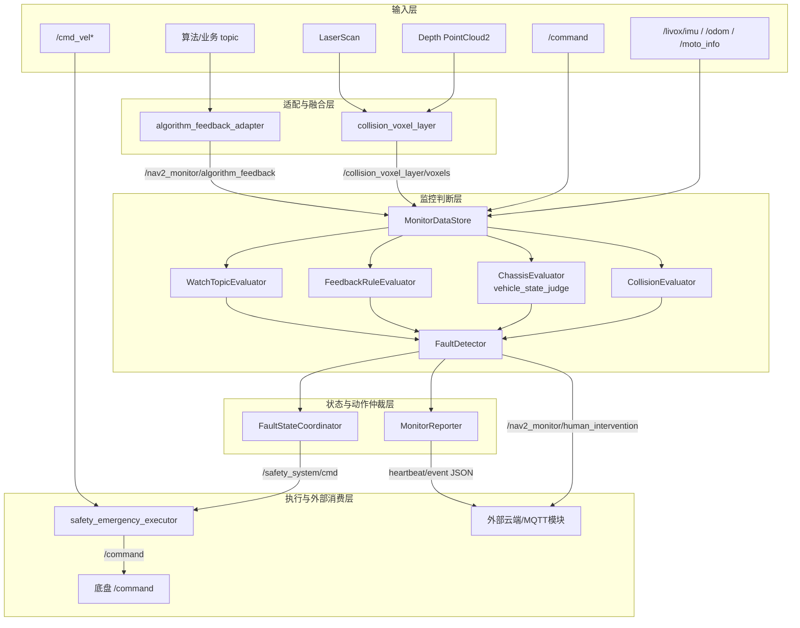
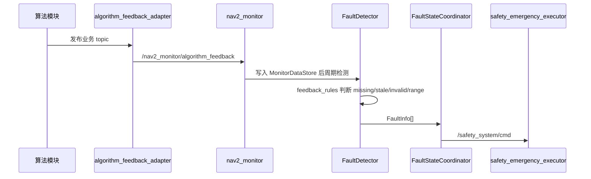
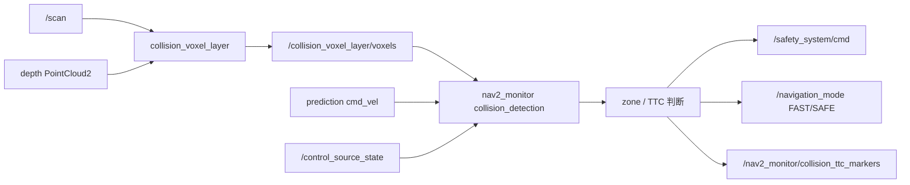
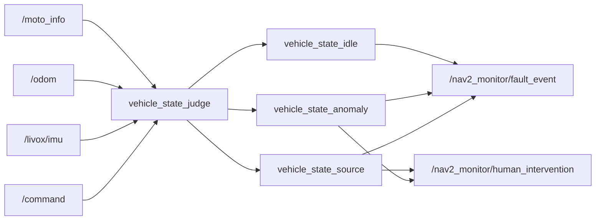
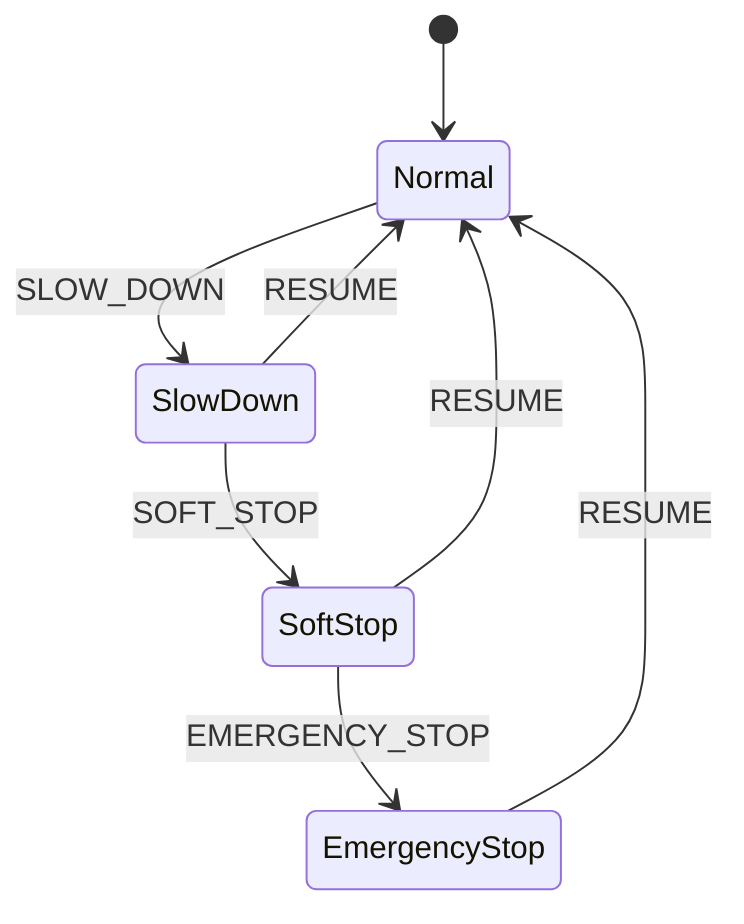
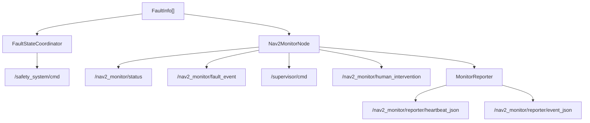
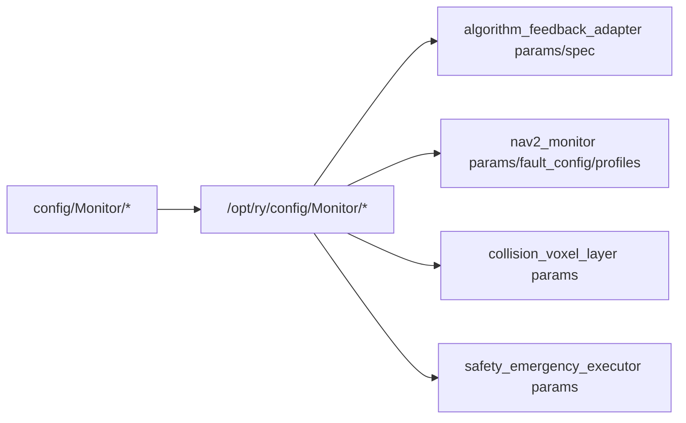

# 项目架构与数据链路

本文档描述 `monitor_system` 的项目级功能边界、数据链路、流程图和模块关系。模块级参数细节请继续参考各包 README 与 [INTERFACES.md](../INTERFACES.md)。

后续模块独立化、可靠数据联通、QoS 分层、CPU 满载降级与上层确认边界的完整方案见：[监控系统模块独立化与可靠数据联通设计方案](monitor_modular_isolation_design.md)。

## 1. 系统定位

`monitor_system` 是机器人本机安全监控与执行链路，不直接承担 MQTT 或云端连接。

核心目标：

- 低侵入接入算法模块输出。
- 先做数据源有效性判断，再做业务规则判断。
- 将不同来源的异常统一成 `FaultInfo`。
- 对安全动作做统一仲裁，避免多个模块抢发安全命令。
- 当需要人工介入时，输出本机 ROS topic 供外部云端/MQTT 模块订阅。

## 2. 功能分层图



## 3. 主数据链路

### 3.1 算法反馈判断链路



说明：

- `algorithm_feedback_adapter` 只负责字段拆解和标准化，不做故障判断。
- `FeedbackRuleEvaluator` 根据 `source_topic + metric_name` 命中规则。
- 安全动作由 `FaultStateCoordinator` 统一仲裁。

### 3.2 碰撞检测链路



关键原则：

- `collision_voxel_layer` 中任一数据源可用时都应继续发布体素。
- `nav2_monitor` 先判断体素/点云数据源是否新鲜，再做 zone/TTC。
- fresh empty source 表示当前无障碍，不等于数据源故障。
- TTC 控制器切换使用滞回和最小保持时间，避免边界反复跳变。

### 3.3 小车状态检测链路



判断策略：

- `/command` 是期望运动来源，必须先判断是否新鲜。
- 实际运动来源优先级为 IMU、odom、moto feedback。
- 有速度指令但实际不动，上报人工介入，可能是急停或底盘异常。
- 无速度指令但实际仍动，超过 `coast_grace_s` 后上报人工介入。
- 无指令且不动过久，输出低优先级 idle 提示。

### 3.4 安全执行链路



安全动作优先级：

```text
EMERGENCY_STOP > SOFT_STOP > SLOW_DOWN > NONE
```

`safety_emergency_executor` 只执行当前仲裁结果，不参与故障判断。

## 4. 输出与上报链路



输出说明：

- `/nav2_monitor/status`：周期状态总览。
- `/nav2_monitor/fault_event`：故障触发/恢复边沿事件。
- `/supervisor/cmd`：supervisor JSON 命令，保留兼容。
- `/nav2_monitor/human_intervention`：仅小车状态检测触发的人工介入提醒。
- `/safety_system/cmd`：安全执行命令。
- reporter JSON：给外部上报模块消费的本机 JSON topic。

## 5. 配置链路



配置约定：

- 仓库 `config/Monitor/*` 是运行配置镜像。
- 实机以 `/opt/ry/config/Monitor/*` 为运行时单一事实来源。
- `nav2_monitor` 的任务配置可按 `default / todoor / elevator / reverse` 切换 fault config。
- `algorithm_feedback_adapter` 的 spec 支持热重载。
- `collision_voxel_layer` 支持参数和文件热重载。

## 6. 主要 topic 总览

| Topic | Type | 生产者 | 消费者 | 说明 |
|---|---|---|---|---|
| `/nav2_monitor/algorithm_feedback` | `nav2_monitor/msg/AlgorithmFeedback` | `algorithm_feedback_adapter` | `nav2_monitor` | 统一算法反馈指标 |
| `/collision_voxel_layer/voxels` | `collision_voxel_layer/msg/VoxelGrid` | `collision_voxel_layer` | `nav2_monitor` | 融合障碍体素 |
| `/collision_voxel_layer/source_status` | `std_msgs/msg/String` | `collision_voxel_layer` | 调试/上报模块 | 体素输入源状态 |
| `/nav2_monitor/status` | `nav2_monitor/msg/MonitorStatus` | `nav2_monitor` | 外部模块 | 周期状态 |
| `/nav2_monitor/fault_event` | `nav2_monitor/msg/FaultEvent` | `nav2_monitor` | 外部模块 | 故障边沿事件 |
| `/nav2_monitor/human_intervention` | `std_msgs/msg/String` | `nav2_monitor` | 外部云端/MQTT模块 | 小车状态人工介入提醒 |
| `/nav2_monitor/reporter/heartbeat_json` | `std_msgs/msg/String` | `nav2_monitor` | 外部云端/MQTT模块 | JSON 心跳 |
| `/nav2_monitor/reporter/event_json` | `std_msgs/msg/String` | `nav2_monitor` | 外部云端/MQTT模块 | JSON 事件 |
| `/safety_system/cmd` | `nav2_monitor/msg/SafetyCmd` | `nav2_monitor` | `safety_emergency_executor` | 安全动作 |
| `/navigation_mode` | `std_msgs/msg/String` | `nav2_monitor` | 导航控制器切换模块 | `FAST` / `SAFE` |
| `/control_source_state` | `std_msgs/msg/String` | `safety_emergency_executor` | `nav2_monitor` | 当前速度控制源 |
| `/command` | `std_msgs/msg/String` | `safety_emergency_executor` | 底盘 | 最终底盘控制 |

## 7. 开发与验证命令

所有 ROS 相关命令建议显式声明 `ROS_DOMAIN_ID=66`。

```bash
env ROS_DOMAIN_ID=66 colcon build --packages-select algorithm_feedback_adapter nav2_monitor collision_voxel_layer safety_emergency_executor
```

```bash
env ROS_DOMAIN_ID=66 ROS_LOG_DIR=/tmp/ros_logs colcon test --packages-select algorithm_feedback_adapter nav2_monitor collision_voxel_layer safety_emergency_executor --event-handlers console_direct+
```

单包测试示例：

```bash
env ROS_DOMAIN_ID=66 ROS_LOG_DIR=/tmp/ros_logs colcon test --packages-select algorithm_feedback_adapter --event-handlers console_direct+
```

```bash
env ROS_DOMAIN_ID=66 ROS_LOG_DIR=/tmp/ros_logs /bin/bash -lc 'source install/setup.bash && build/nav2_monitor/test_fault_detector'
```

## 8. 设计原则

- 数据源检测优先于业务判断。
- 单个数据源丢失不应导致整条障碍链路失效。
- 故障判断和安全执行解耦。
- 安全动作集中仲裁，避免多点直接控制底盘。
- 人工介入提醒和云端上报解耦，本项目只发布本机 ROS topic。
- 配置统一迁移到 `/opt/ry/config/Monitor`，仓库保持镜像文件用于版本管理。
